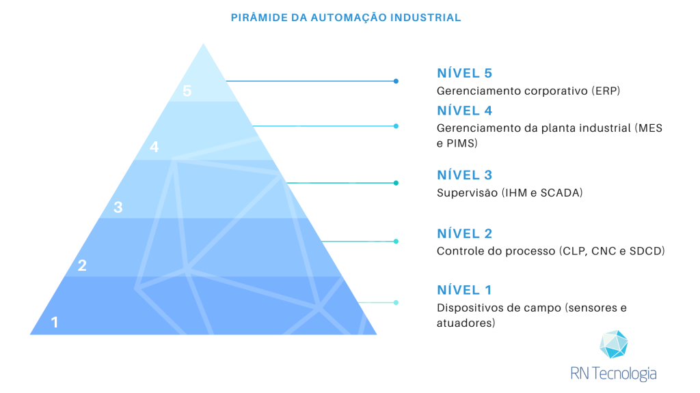
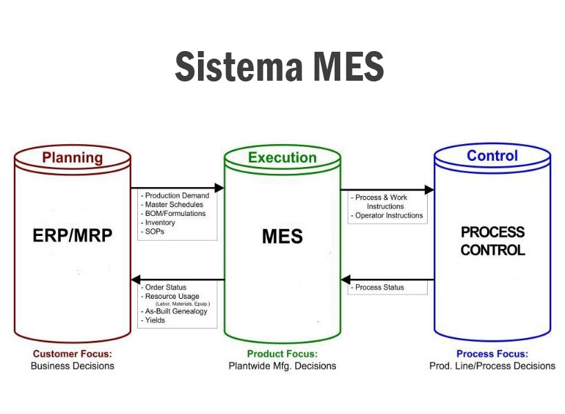

# *Relatório: Introdução às Redes Industriais e Pirâmide da Automação*

## **1. Introdução às Redes Industriais**

### *1.1 Definição e Objetivo das Redes Industriais*

As redes industriais são sistemas de comunicação projetados para conectar sensores, atuadores, controladores e outros dispositivos em ambientes industriais. Diferentemente das redes comerciais, elas são otimizadas para **tempo real**, **robustez**, **segurança** e **confiabilidade**.

Elas desempenham um papel essencial na automação industrial, permitindo a *integração horizontal* (entre dispositivos de controle) e *vertical* (entre os sistemas de produção e os sistemas empresariais).

### *1.2 Importância das Redes Industriais na Automação*

- **Redução da complexidade do cabeamento:** Utilizam redes digitais em vez de conexões ponto a ponto.
- **Eficiência e produtividade:** Monitoramento remoto e controle em tempo real reduzem falhas e otimizam processos.
- **Rastreabilidade:** Dados detalhados permitem otimização de processos produtivos.
- **Base para Indústria 4.0 e IoT Industrial (IIoT):** Redes industriais conectadas viabilizam análises preditivas e automação inteligente.

### *1.3 Diferenças entre Redes Industriais e Redes de TI*

| Característica | Redes Industriais | Redes de TI |
| --- | --- | --- |
| **Objetivo** | Controle e monitoramento | Comunicação de dados e internet |
| **Latência** | Baixa (tempo real) | Alta tolerância a atrasos |
| **Confiabilidade** | Alta, com redundância | Variável, depende da estrutura |
| **Protocolos** | PROFINET, Modbus, EtherCAT | TCP/IP, HTTP, FTP |
| **Ambiente** | Chão de fábrica | Escritórios e data centers |

### *1.4 Exemplos de Aplicação das Redes Industriais*

- **Indústria Automobilística:** Controle de robôs em linhas de montagem.
- **Indústria Farmacêutica:** Rastreabilidade de lotes e monitoramento de temperatura.
- **Geração de Energia:** Controle de turbinas eólicas e redes elétricas inteligentes.
- **Logística:** Rastreamento de frotas e automação de armazéns.

## **2. Pirâmide da Automação**

### *2.1 Estrutura da Pirâmide da Automação*

A Pirâmide da Automação descreve a hierarquia de controle e gestão na indústria, estruturada em cinco níveis:

### *2.2 Níveis da Pirâmide*

#### *2.2.1 Nível de Campo (Sensores e Atuadores)*
- *Função:* Coleta de dados e execução de comandos.
- *Protocolos:* IO-Link, ASi.
- *Exemplo:* Sensores de temperatura monitorando motores.

#### *2.2.2 Nível de Controle (CLPs e SDCDs)*
- *Função:* Controle de processos industriais.
- *Protocolos:* Modbus, PROFIBUS, DeviceNet.
- *Exemplo:* CLP ajustando a velocidade de uma esteira.

#### *2.2.3 Nível de Supervisão (SCADA e IHM)*
- *Função:* Monitoramento e supervisão em tempo real.
- *Protocolos:* OPC UA, MQTT.
- *Exemplo:* Operador monitorando alarmes via SCADA.

#### *2.2.4 Nível de Gerenciamento (MES - Manufacturing Execution System)*
- *Função:* Gestão da produção e rastreabilidade.
- *Protocolos:* SQL, OPC UA.
- *Exemplo:* Registro de produtos fabricados e falhas.

#### *2.2.5 Nível Corporativo (ERP - Enterprise Resource Planning)*
- *Função:* Gestão empresarial e integração de recursos.
- *Protocolos:* Web Services, REST API.
- *Exemplo:* Ajuste automático de compras com base na produção.

### *2.3 Evolução da Pirâmide e Indústria 4.0*

A Indústria 4.0 está transformando a pirâmide tradicional, permitindo maior integração entre os níveis. Tecnologias como *IIoT, Edge Computing e inteligência artificial* estão tornando a estrutura mais horizontal e conectada.

## **3. Protocolos e Tecnologias Industriais**

### *3.1 Introdução aos Protocolos Industriais*

Protocolos garantem a comunicação segura e eficiente entre dispositivos industriais. São divididos em:
- *Protocolos Fieldbus:* Modbus, PROFIBUS.
- *Protocolos Ethernet Industrial:* PROFINET, Ethernet/IP, EtherCAT.

### *3.2 Principais Protocolos Industriais*

| Protocolo | Tipo | Aplicação |
| --- | --- | --- |
| *Modbus* | Serial/Ethernet | Sensores e CLPs |
| *PROFINET* | Ethernet | Automação industrial |
| *Ethernet/IP* | Ethernet | Robótica e controle |
| *EtherCAT* | Ethernet | Controle de movimento |
| *OPC UA* | Ethernet | IIoT e Indústria 4.0 |

### *3.3 Tendências Tecnológicas*

- *Integração com a Nuvem e Edge Computing.*
- *IIoT:* Dispositivos conectados otimizando processos.
- *Redes 5G:* Comunicação de alta velocidade e baixa latência.
- *Cibersegurança:* Proteção contra ataques industriais.

## **4. Desafios e Benefícios das Redes Industriais**

### *4.1 Desafios*

- *Interoperabilidade:* Fabricantes diferentes utilizam de protocolos diferentes.
- *Latência e Tempo de Resposta:* Aplicações críticas exigem baixa latência.
- *Segurança Cibernética:* Redes conectadas são alvos de ataques.
- *Diagnóstico de Falhas:* Ferramentas como OPC UA ajudam na detecção.
- *Custo de Implementação:* Atualizar sistemas antigos pode ser caro.

### *4.2 Benefícios*

- *Maior Eficiência:* Monitoramento em tempo real reduz desperdícios.
- *Manutenção Preditiva:* Sensores detectam falhas antes que ocorram.
- *Redução de Custos:* Automação diminui erros e retrabalho.
- *Integração ERP/MES/SCADA:* Otimização da produção e rastreabilidade.
- *Segurança e Conformidade:* Registros detalhados garantem qualidade.